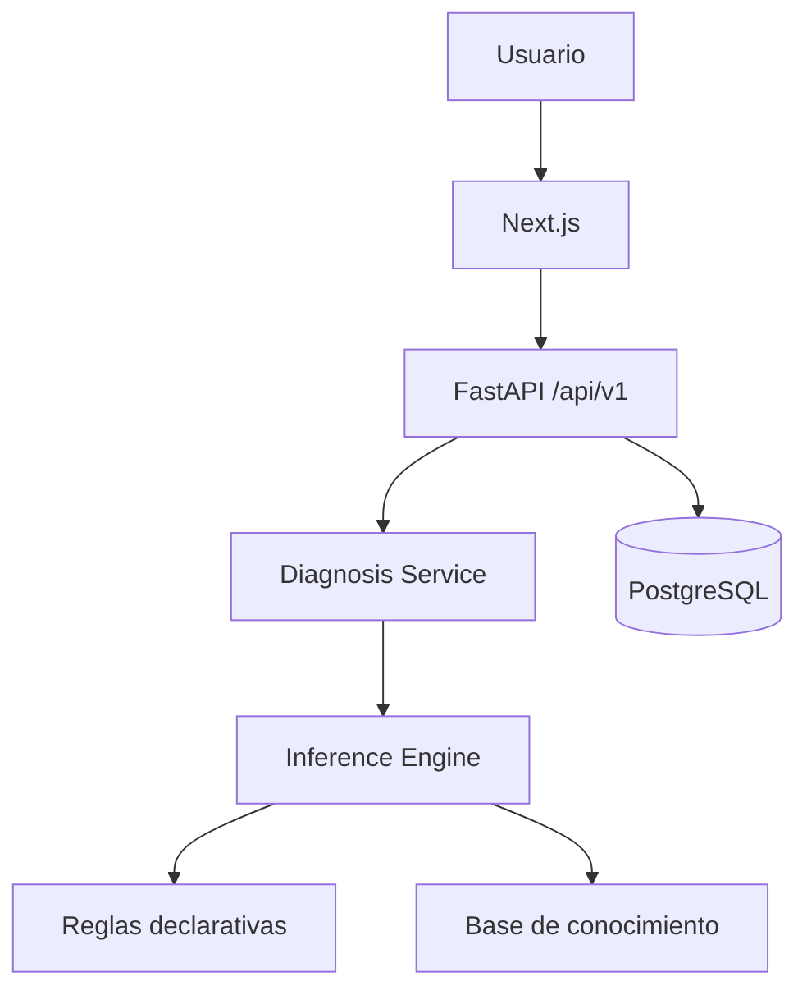

# CaféSalud

CaféSalud es una base full-stack para orientar el diagnóstico preliminar de enfermedades en plantas de café. Combina una landing responsive en Next.js con una API FastAPI y un motor de reglas declarativo, explicable y preparado para crecer sin acoplar conocimiento agronómico a los controladores.

> La puntuación representa coincidencia con reglas de demostración. No es una probabilidad científica ni reemplaza la evaluación de un profesional agrónomo.

## Stack

- Frontend: Next.js 16, React 19, TypeScript, App Router, Tailwind CSS 4 y Lucide.
- Backend: Python 3.13, FastAPI, Pydantic, SQLAlchemy 2 y Alembic.
- Datos: PostgreSQL 17.
- Calidad: pytest, coverage, ESLint y TypeScript.
- Infraestructura: Docker Compose con healthchecks y builds multi-stage.

## Arquitectura



El catálogo y las reglas se versionan inicialmente en código para que sean revisables y fáciles de probar. PostgreSQL ya contiene las entidades necesarias para persistir conocimiento y sesiones cuando el producto lo requiera.

```text
.
├── backend/
│   ├── alembic/                 # migraciones
│   ├── app/
│   │   ├── api/v1/              # rutas HTTP
│   │   ├── core/                # configuración y logging
│   │   ├── db/                  # sesión y metadata SQLAlchemy
│   │   ├── domain/              # entidades de dominio
│   │   ├── expert_system/
│   │   │   ├── engine/          # evaluación e inferencia
│   │   │   ├── explanations/    # explicaciones
│   │   │   ├── knowledge/       # enfermedades, preguntas y reglas
│   │   │   └── scoring/         # ranking
│   │   ├── models/              # tablas SQLAlchemy
│   │   ├── repositories/        # acceso al conocimiento
│   │   ├── schemas/             # contratos Pydantic
│   │   └── services/            # casos de uso
│   └── tests/
├── frontend/
│   ├── public/images/           # recursos locales
│   └── src/
│       ├── app/                 # / y /diagnostico
│       ├── components/          # layout, landing y UI
│       ├── constants/           # contenido y rutas de imágenes
│       ├── features/diagnosis/  # base del flujo diagnóstico
│       ├── services/            # cliente de API
│       └── types/
├── docs/
│   ├── sistema-experto.drawio   # fuente entregada por el usuario
│   └── image-prompts.md         # trazabilidad de assets generados
└── docker-compose.yml
```

## Inicio rápido

1. Copia las variables de ejemplo:

   ```bash
   cp .env.example .env
   ```

2. Levanta el sistema:

   ```bash
   docker compose up --build
   ```

3. Abre:

   - Landing: <http://localhost:3000>
   - Diagnóstico: <http://localhost:3000/diagnostico>
   - API: <http://localhost:8000/api/v1/health>
   - Swagger: <http://localhost:8000/docs>

Para detenerlo:

```bash
docker compose down
```

## Variables de entorno

| Variable | Uso | Valor de desarrollo |
|---|---|---|
| `POSTGRES_DB` | Base de datos | `cafesalud` |
| `POSTGRES_USER` | Usuario de PostgreSQL | `cafesalud` |
| `POSTGRES_PASSWORD` | Contraseña local | `cafesalud_dev` |
| `DATABASE_URL` | Conexión SQLAlchemy | `postgresql+psycopg://...@db:5432/cafesalud` |
| `NEXT_PUBLIC_API_URL` | URL pública del backend | `http://localhost:8000/api/v1` |
| `CORS_ORIGINS` | Orígenes autorizados | `http://localhost:3000` |

No almacenes secretos reales en `.env.example` ni en Git.

## API

| Método | Ruta | Descripción |
|---|---|---|
| `GET` | `/api/v1/health` | Estado del servicio |
| `GET` | `/api/v1/diseases` | Catálogo de enfermedades |
| `GET` | `/api/v1/diseases/{id}` | Detalle de una enfermedad |
| `GET` | `/api/v1/diagnosis/questions?affected_part=leaf\|stem\|fruit` | Preguntas dinámicas filtradas por parte afectada |
| `POST` | `/api/v1/diagnosis/evaluate` | Evalúa respuestas y devuelve ranking y explicación |

Ejemplo:

```bash
curl -X POST http://localhost:8000/api/v1/diagnosis/evaluate \
  -H "Content-Type: application/json" \
  -d '{
    "answers": {
      "affected_part": "leaf",
      "leaf_lesions": true,
      "yellow_spots": true,
      "orange_powder_underside": true,
      "humid_conditions": true
    }
  }'
```

La respuesta contiene `primary_hypothesis`, alternativas, evidencia coincidente, explicación, recomendaciones y descargo.

## Motor experto

El flujo implementado es:

```text
respuestas -> normalización -> evaluación de reglas -> scoring -> ranking -> explicación -> recomendaciones
```

Cada regla agrupa condiciones tipadas. Una condición puede ser obligatoria para descartar rutas incompatibles (por ejemplo, una regla foliar cuando la parte afectada es fruto). El score se calcula con pesos relativos de demostración y se expresa como coincidencia (`low`, `medium`, `high`).

Reglas iniciales:

- Roya del café: lesión foliar, manchas amarillas y signos anaranjados en el envés.
- Mancha de hierro: lesión circular parda, centro claro y halo amarillento/rojizo.
- Ojo de gallo / Gotera: lesión tipo diana, centro claro y margen oscuro.

Los pesos están marcados para validación con un experto agrónomo. Las rutas de tallo/rama y fruto exponen preguntas derivadas del diagrama, pero no asignan enfermedades que la fuente no especifica.

### Agregar una enfermedad

1. Añade su definición a `backend/app/expert_system/knowledge/catalog.py`.
2. Añade sus síntomas/preguntas a `knowledge/questions.py`.
3. Añade una o más reglas a `knowledge/rules.py`.
4. Incorpora pruebas de ranking y explicación.

No es necesario modificar rutas HTTP ni el servicio de diagnóstico.

### Agregar una regla

Usa condiciones declarativas:

```python
Rule(
    id="identificador-revisable",
    disease_id="coffee_rust",
    conditions=(
        Condition("affected_part", "leaf", "Parte afectada: hoja", 2, required=True),
        Condition("yellow_spots", True, "Manchas amarillas", 2),
    ),
)
```

Todo peso nuevo debe quedar sustentado o marcado para revisión agronómica.

## Imágenes

Las rutas se centralizan en `frontend/src/constants/images.ts` y se consumen con `next/image`.

```text
frontend/public/images/
├── hero/
├── diseases/
├── symptoms/
├── coffee/
└── illustrations/
```

Los cuatro recursos actuales fueron generados para el proyecto y no dependen de URLs externas. Para reemplazar el hero, conserva la ruta `public/images/hero/coffee-hero.png` o actualiza la constante.

## Desarrollo sin Docker

Backend:

```bash
cd backend
python -m venv .venv
# Windows: .venv\Scripts\activate
# macOS/Linux: source .venv/bin/activate
pip install -e ".[dev]"
uvicorn app.main:app --reload
```

Frontend:

```bash
cd frontend
npm install
npm run dev
```

## Calidad y pruebas

```bash
# Backend local
cd backend
python -m pytest --cov=app --cov-report=term-missing

# Backend en Docker
docker compose run --rm backend python -m pytest

# Frontend
cd frontend
npm run lint
npm run typecheck
npm run build
```

## Pendientes controlados

- Validar reglas, pesos y recomendaciones con un profesional agrónomo.
- Definir hipótesis concretas para tallo/rama y fruto antes de codificar reglas.
- Persistir sesiones y resultados del cuestionario.
- Añadir tests de integración con una base de datos aislada.
